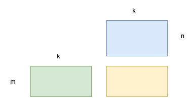

# matmul 计算

矩阵乘法的定义


其中 𝐴、𝐵、𝐶 三者的形状分别为 𝑀×𝐾 、 𝐾×𝑁 、 𝑀×𝑁。图一是矩阵乘的可视化展示，和计算时为得到一个输出点所要使用的输入数据。



根据定义实现的代码：

```cpp
for (i = 0; i < m; i++) {   /* Loop over the rows of C */
    for (j = 0; j < n; j++) { /* Loop over the columns of C */
      for (p = 0; p < k; p++) {
        /* Update C(i,j) with the inner
            product of the ith
            row of A and the jth column of B */
        C(i, j) = C(i, j) + A(i, p) * B(p, j);
      }
    }
  }
```

上述代码在M=3，K=512，N=512时，在Cortex-A75(2200 MHz)上的运行时间为1.5ms，GFLOPS为1.048。实测A75的单核GFLOPS为17.176333。硬件有效利用率仅为 6.1%。优化空间很大。


对这样的矩阵乘的算法优化可分为两类：
- 基于算法分析的方法：根据矩阵乘计算特性，从数学角度优化，典型的算法包括 Strassen 算法和 Coppersmith–Winograd 算法。
- 基于软件优化的方法：根据计算机存储系统的层次结构特性，选择性地调整计算顺序，主要有循环拆分向量化、内存重排等。

# 基于软件优化的方法


# 优化思路2

# 。。。


# tvm auto-tvm template-based 手写schedule

# tvm ansor template-free